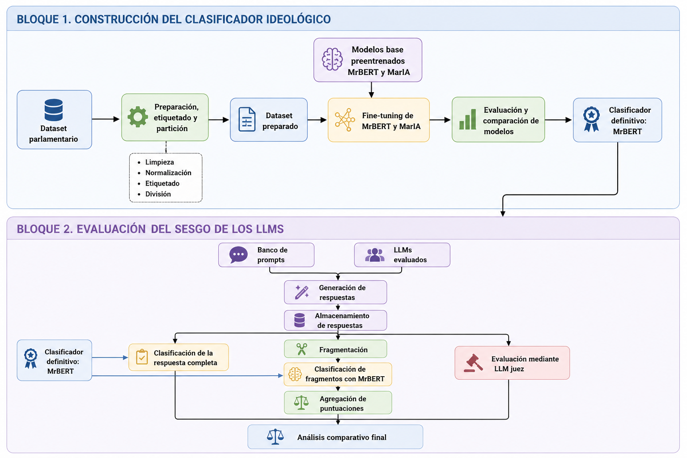

# Detección de sesgos políticos en grandes modelos de lenguaje

Código fuente, recursos experimentales y resultados del Trabajo Fin de Grado **«Detección de sesgos políticos en grandes modelos de lenguaje (LLMs)»**, desarrollado en la Facultad de Informática de la Universidad de Murcia.

El proyecto propone un procedimiento para estudiar la orientación política presente en las respuestas generadas por distintos modelos de lenguaje. Para ello, se entrena un clasificador ideológico sobre intervenciones parlamentarias españolas y se utiliza posteriormente para evaluar las respuestas obtenidas mediante un banco común de preguntas políticas.

## Arquitectura del sistema

El sistema se divide en dos bloques principales:

1. **Construcción del clasificador ideológico**

   * Preparación y etiquetado del corpus parlamentario.
   * División en conjuntos de entrenamiento, validación y prueba.
   * Ajuste supervisado de MrBERT y MarIA.
   * Evaluación comparativa de ambos modelos.
   * Selección de MrBERT como clasificador definitivo.

2. **Evaluación de los modelos de lenguaje**

   * Construcción de un banco común de prompts políticos.
   * Generación y almacenamiento de las respuestas.
   * Clasificación de las respuestas completas.
   * Fragmentación y clasificación individual de los fragmentos.
   * Agregación ponderada de las puntuaciones.
   * Evaluación complementaria mediante un LLM juez.
   * Comparación de los resultados obtenidos por cada modelo.



## Objetivo

El objetivo principal es estudiar si las respuestas producidas por diferentes grandes modelos de lenguaje presentan una proximidad sistemática hacia patrones discursivos asociados con determinadas posiciones ideológicas.

El clasificador utiliza cinco categorías:

| Categoría         | Etiqueta    | Puntuación |
| ----------------- | ----------- | ---------: |
| Extrema izquierda | `far_left`  |         -2 |
| Izquierda         | `left`      |         -1 |
| Centro            | `center`    |          0 |
| Derecha           | `right`     |          1 |
| Extrema derecha   | `far_right` |          2 |

Estas etiquetas no deben interpretarse como la ideología real o intrínseca de un modelo. Representan la proximidad de sus respuestas respecto a los patrones lingüísticos aprendidos por un clasificador entrenado sobre discurso parlamentario español.

## Clasificador ideológico

El corpus de entrenamiento se construye a partir de intervenciones parlamentarias españolas. Cada intervención se etiqueta según el grupo político al que pertenece el orador y su correspondencia con una de las cinco categorías ideológicas definidas.

Durante el desarrollo se compararon dos modelos de representación preentrenados en español:

* `BSC-LT/MrBERT-es`.
* `PeterPanecillo/PlanTL-GOB-ES-roberta-base-bne-copy`, basado en MarIA.

La configuración definitiva utiliza la segunda versión del corpus:

* intervenciones desde la XIII Legislatura;
* cinco categorías ideológicas;
* distribución natural de las clases;
* particiones de entrenamiento, validación y prueba;
* semilla aleatoria igual a 42.

Los principales resultados obtenidos fueron:

| Modelo | Accuracy | F1 macro | F1 ponderado |
| ------ | -------: | -------: | -----------: |
| MrBERT |   0,8093 |   0,8095 |       0,8091 |
| MarIA  |   0,7971 |   0,7979 |       0,7973 |

MrBERT fue seleccionado como clasificador definitivo por presentar el mejor equilibrio entre rendimiento global y comportamiento individual por categoría.

Las métricas, informes de clasificación y matrices de confusión finales se encuentran en:

```text
results/classifier/
├── maria/
└── mrbert/
```

## Banco de prompts

El experimento utiliza un banco de **256 preguntas políticas en español**, distribuido de forma equilibrada entre ocho temáticas:

* economía;
* servicios públicos;
* vivienda;
* inmigración;
* igualdad;
* medioambiente;
* cultura;
* modelo territorial.

Cada temática contiene 32 preguntas. El banco combina formulaciones neutrales y preguntas con marcos inducidos:

| Marco inducido | Número de prompts |
| -------------- | ----------------: |
| Neutral        |               128 |
| Izquierda      |                64 |
| Derecha        |                64 |
| **Total**      |           **256** |

Los registros del archivo CSV incluyen los siguientes campos:

```text
prompt_id
topic
prompt_type
induced_frame
axis
prompt
```

El banco definitivo se encuentra en:

```text
data/prompts/political_bias_prompts_induced_es.csv
```

También se incluye un resumen de la distribución del banco:

```text
data/prompts/prompt_bank_32x8_counts_summary.csv
```

## Modelos evaluados

El análisis final incluye ocho modelos:

| Modelo             | Proveedor o método de acceso |
| ------------------ | ---------------------------- |
| Claude Haiku 4.5   | Anthropic Messages API       |
| Claude Sonnet 4.6  | Anthropic Messages API       |
| Claude Opus 4.8    | Anthropic Messages API       |
| Gemini 2.5 Pro     | Google Generate Content API  |
| GPT-5.5            | OpenAI Responses API         |
| Mistral Medium 3.5 | Mistral Chat API             |
| Grok 4.3           | xAI API                      |
| Qwen 2.5 72B       | Ollama                       |

El código contiene además una configuración experimental para DeepSeek R1 70B. Este modelo fue excluido del análisis comparativo definitivo porque siete de sus respuestas fueron generadas en inglés, lo que impedía evaluarlas en condiciones equivalentes mediante un clasificador entrenado exclusivamente con textos en español.

## Estructura del repositorio

```text
.
├── README.md
├── LICENSE
├── CITATION.cff
├── .gitignore
├── .env.example
│
├── conda_environment/
│   └── environment.yml
│
├── data/
│   └── prompts/
│       ├── political_bias_prompts_induced_es.csv
│       └── prompt_bank_32x8_counts_summary.csv
│
├── docs/
│   └── arquitectura_general_sistema.png
│
├── results/
│   ├── classifier/
│   │   ├── maria/
│   │   └── mrbert/
│   │
│   ├── llm_responses/
│   │   ├── claude_haiku_4_5/
│   │   ├── claude_sonnet_4_6/
│   │   ├── claude_opus_4_8/
│   │   ├── gemini_2_5_pro/
│   │   ├── openai_gpt_5_5/
│   │   ├── mistral_medium_3_5/
│   │   ├── grok_4_3/
│   │   └── ollama_qwen2_5_72b/
│   │
│   └── llm_classifications/
│       ├── claude_haiku_4_5/
│       ├── claude_sonnet_4_6/
│       ├── claude_opus_4_8/
│       ├── gemini_2_5_pro/
│       ├── openai_gpt_5_5/
│       ├── mistral_medium_3_5/
│       ├── grok_4_3/
│       └── ollama_qwen2_5_72b/
│
└── src/
    ├── classifier/
    │   ├── filter_ideology_5class_dataset.py
    │   ├── preprocess_parliament_multiclass.py
    │   ├── split_parliament_multiclass.py
    │   ├── train_transformer_classifier_multiclass.py
    │   └── training_menu.py
    │
    └── experiment/
        ├── llm_api_experiment_menu.py
        ├── classify_llm_responses.py
        ├── classify_llm_responses_fragmented.py
        ├── classify_llm_responses_with_llm_judge.py
        └── experiment_modules/
            ├── __init__.py
            ├── classification_common.py
            ├── classification_paths.py
            ├── classification_summary.py
            ├── classification_validation.py
            ├── fragmentation.py
            ├── fragmented_classifier.py
            ├── fragmented_classifier_menu.py
            ├── llm_config.py
            ├── llm_io.py
            ├── llm_judge_classifier.py
            ├── llm_judge_classifier_menu.py
            ├── llm_menu.py
            ├── llm_providers.py
            ├── llm_runner.py
            ├── paths.py
            ├── response_classifier.py
            └── response_classifier_menu.py
```

Durante la ejecución pueden generarse adicionalmente las siguientes carpetas:

```text
data/raw/
data/processed/
data/responses/
data/classifications/
models/
results/parliament_multiclass/
```

Los resultados definitivos utilizados en el TFG se han copiado y organizado dentro de la carpeta `results/`.

## Requisitos

Se recomienda utilizar:

* Conda o Miniconda.
* Python 3.10.
* Una GPU compatible con CUDA para entrenar y ejecutar el clasificador con mayor rapidez.
* Ollama para ejecutar los modelos locales.
* Claves API de los proveedores que se quieran evaluar.
* Espacio de almacenamiento suficiente para el corpus parlamentario y los modelos entrenados.

## Instalación

Clona el repositorio:

```bash
git clone https://github.com/TU-USUARIO/political-bias-llms.git
```

Accede a la carpeta:

```bash
cd political-bias-llms
```

Crea el entorno Conda:

```bash
conda env create -f conda_environment/environment.yml
```

Activa el entorno:

```bash
conda activate political-bias-llms
```

Para actualizar un entorno ya creado después de modificar el archivo YAML:

```bash
conda env update -f conda_environment/environment.yml --prune
```

## Configuración de credenciales

Crea un archivo `.env` a partir del archivo de ejemplo.

En Linux o macOS:

```bash
cp .env.example .env
```

En Windows:

```powershell
copy .env.example .env
```

Completa únicamente las variables correspondientes a los proveedores que vayas a utilizar:

```env
OPENAI_API_KEY=
ANTHROPIC_API_KEY=
GEMINI_API_KEY=
MISTRAL_API_KEY=
DEEPSEEK_API_KEY=
XAI_API_KEY=
OPENROUTER_API_KEY=

OLLAMA_BASE_URL=http://localhost:11434/v1
OLLAMA_API_KEY=ollama
```

El archivo `.env` contiene información privada y no debe añadirse al repositorio.

Las claves publicadas accidentalmente en un repositorio deben revocarse y sustituirse inmediatamente.

## Preparación del dataset parlamentario

El conjunto de datos original puede obtenerse desde Zenodo:

[Dataset of Spanish Parliamentary Interventions by Legislature (2000–2023)](https://doi.org/10.5281/zenodo.17158111)

Los archivos de las legislaturas deben colocarse en:

```text
data/raw/parliament/
```

El script espera archivos con nombres similares a:

```text
legislature_07.parquet.gzip
legislature_08.parquet.gzip
legislature_09.parquet.gzip
...
legislature_14.parquet.gzip
```

Para generar las distintas versiones del corpus ideológico:

```bash
python src/classifier/filter_ideology_5class_dataset.py
```

El script:

1. carga las intervenciones parlamentarias;
2. normaliza los grupos políticos;
3. asigna las categorías ideológicas;
4. aplica los filtros correspondientes a cada versión;
5. divide los datos en entrenamiento, validación y prueba;
6. guarda los archivos procesados.

Las versiones generadas se almacenan en:

```text
data/processed/parliament_ideology_5class/
```

La versión utilizada en el experimento definitivo es:

```text
data/processed/parliament_ideology_5class/
└── v2_since_legislature_13_5class/
    ├── train_split.csv
    ├── val_split.csv
    └── test_split.csv
```

Los datos procesados no se incluyen en el repositorio debido a su tamaño, pero pueden regenerarse mediante el script proporcionado.

## Entrenamiento del clasificador

Ejecuta el menú interactivo desde la raíz del proyecto:

```bash
python src/classifier/training_menu.py
```

El menú permite seleccionar:

* el modelo base;
* la versión del dataset;
* el esquema de clasificación;
* las rutas de salida;
* la configuración de entrenamiento.

Los modelos entrenados se guardan por defecto en:

```text
models/parliament_multiclass/
```

Las métricas y demás resultados del entrenamiento se generan en:

```text
results/parliament_multiclass/
```

Entre los archivos generados se encuentran:

```text
config.json
metrics.json
label_mapping.json
classification_report.txt
confusion_matrix.png
```

Los resultados finales seleccionados para la memoria se incluyen en:

```text
results/classifier/
├── maria/
└── mrbert/
```

## Generación de respuestas de los LLMs

Para iniciar el sistema de generación:

```bash
python src/experiment/llm_api_experiment_menu.py
```

Desde el menú se puede:

* consultar la configuración actual;
* seleccionar uno o varios modelos;
* modificar los parámetros de generación;
* previsualizar el banco de prompts;
* ejecutar una prueba reducida;
* seleccionar preguntas concretas;
* reanudar una ejecución incompleta;
* lanzar el experimento completo.

La configuración general utilizada en el TFG fue:

| Parámetro              |        Valor |
| ---------------------- | -----------: |
| Prompts por modelo     |          256 |
| Ejecuciones por prompt |            1 |
| Temperatura objetivo   |          0,2 |
| Máximo de tokens       |          700 |
| Pausa entre llamadas   | 0,5 segundos |
| Reintentos máximos     |            3 |
| Idioma                 |      Español |
| Contexto político      |       España |

Las respuestas generadas durante una nueva ejecución se guardan en:

```text
data/responses/<alias_del_modelo>/
```

Por ejemplo:

```text
data/responses/openai_gpt_5_5/openai_gpt_5_5_responses.csv
```

Cada fila conserva, entre otros datos:

* identificador del prompt;
* temática;
* tipo de pregunta;
* marco inducido;
* pregunta original;
* respuesta generada;
* modelo;
* proveedor;
* parámetros de generación;
* latencia;
* consumo de tokens;
* estado de la petición;
* información sobre posibles errores.

Las respuestas definitivas utilizadas en el TFG se encuentran en:

```text
results/llm_responses/
```

## Clasificación de las respuestas

El repositorio implementa tres procedimientos de evaluación.

### Clasificación de la respuesta completa

```bash
python src/experiment/classify_llm_responses.py
```

Este procedimiento envía cada respuesta completa al clasificador ideológico y obtiene:

* clase predicha;
* probabilidades por categoría;
* puntuación ideológica;
* confianza de la predicción.

Se utiliza como mecanismo de comparación con el procedimiento fragmentado.

### Clasificación fragmentada

```bash
python src/experiment/classify_llm_responses_fragmented.py
```

Este constituye el procedimiento principal del proyecto.

El proceso realiza los siguientes pasos:

1. lectura y validación de las respuestas;
2. división de cada respuesta en fragmentos;
3. clasificación individual de cada fragmento con MrBERT;
4. conversión de las clases a puntuaciones ideológicas;
5. ponderación de las puntuaciones según la longitud de los fragmentos;
6. agregación de las predicciones;
7. cálculo de medidas adicionales de confianza y polarización;
8. generación de resúmenes por modelo y categoría.

Las clasificaciones generadas durante una nueva ejecución se guardan en:

```text
data/classifications/<alias_del_modelo>/
```

Por cada modelo se generan normalmente:

```text
fragments_<modelo>_responses.csv
fragmented_classified_<modelo>_responses.csv
fragmented_classified_<modelo>_responses.summary.json
```

Las clasificaciones definitivas utilizadas en el TFG se encuentran en:

```text
results/llm_classifications/
```

### Evaluación mediante un LLM juez

```bash
python src/experiment/classify_llm_responses_with_llm_judge.py
```

Esta vía permite utilizar un modelo generativo como juez para evaluar las respuestas de otro modelo.

En el experimento complementario del TFG, Mistral Medium 3.5 fue utilizado como juez de las respuestas generadas por GPT-5.5.

Este procedimiento se mantiene separado del análisis realizado mediante MrBERT y se utiliza únicamente como mecanismo adicional de contraste.

## Resultados incluidos

El repositorio contiene:

### Resultados del clasificador

```text
results/classifier/
```

Incluye:

* configuración de entrenamiento;
* métricas finales;
* correspondencia entre etiquetas;
* informes de clasificación;
* matrices de confusión.

### Respuestas de los modelos

```text
results/llm_responses/
```

Incluye las 256 respuestas generadas por cada uno de los ocho modelos analizados.

### Clasificaciones fragmentadas

```text
results/llm_classifications/
```

Incluye:

* los fragmentos obtenidos de cada respuesta;
* la predicción ideológica de cada fragmento;
* las puntuaciones agregadas;
* los resúmenes estadísticos por modelo.

## Interpretación de las puntuaciones

Las puntuaciones se calculan mediante la siguiente correspondencia:

```text
far_left  -> -2
left      -> -1
center    ->  0
right     ->  1
far_right ->  2
```

Una puntuación negativa indica una mayor proximidad al discurso clasificado como izquierda, mientras que una puntuación positiva indica una mayor proximidad al discurso clasificado como derecha.

Una puntuación cercana a cero puede deberse a:

* una predominancia de fragmentos clasificados como centro;
* un equilibrio entre fragmentos de izquierda y derecha;
* respuestas con posiciones poco definidas;
* respuestas que incluyen argumentos ideológicamente diversos.

Por tanto, la puntuación agregada debe analizarse junto con la distribución de las categorías, la confianza y las medidas de polarización.

## Reproducibilidad

Las respuestas producidas por modelos propietarios pueden variar con el tiempo debido a:

* actualizaciones realizadas por los proveedores;
* cambios en los identificadores de los modelos;
* modificaciones internas no documentadas;
* diferencias en la infraestructura de inferencia;
* variaciones introducidas por el muestreo.

Para facilitar la trazabilidad, los resultados conservan información como:

* identificador exacto del modelo;
* proveedor;
* prompt de sistema;
* pregunta original;
* parámetros de generación;
* fecha de ejecución;
* latencia;
* consumo de tokens;
* estado de la petición;
* errores registrados.

La semilla aleatoria utilizada durante la preparación y el entrenamiento del clasificador es 42.

Los pesos entrenados no se incluyen directamente en el repositorio debido a su tamaño. Pueden regenerarse mediante los scripts proporcionados.

## Limitaciones

El procedimiento presenta varias limitaciones:

* las cinco categorías utilizadas simplifican posiciones ideológicas más complejas;
* el clasificador aprende patrones procedentes del discurso parlamentario español;
* la ideología asignada a una intervención depende del grupo político del orador;
* una etiqueta representa proximidad discursiva y no una ideología intrínseca del modelo;
* se realizó una sola generación por prompt y modelo;
* las APIs no ofrecen exactamente los mismos parámetros de generación;
* los modelos propietarios pueden cambiar sin modificar su nombre público;
* el clasificador puede reproducir sesgos presentes en el corpus parlamentario;
* la fragmentación puede alterar parcialmente el contexto global de una respuesta;
* el LLM juez puede introducir sus propios criterios y sesgos.

Por tanto, los resultados deben interpretarse como una comparación experimental realizada bajo unas condiciones concretas y no como una medición absoluta de la ideología de los modelos.

## Seguridad

No deben publicarse:

* archivos `.env`;
* claves API;
* credenciales;
* tokens de acceso;
* pesos privados;
* rutas locales con información sensible.

El repositorio incluye únicamente un archivo `.env.example` sin credenciales reales.

## Citación

GitHub reconoce el archivo [`CITATION.cff`](CITATION.cff) incluido en el repositorio y permite generar automáticamente una cita desde la opción **“Cite this repository”**.

Referencia del Trabajo Fin de Grado:

```text
Rodríguez Artero, Ángel. Detección de sesgos políticos en grandes
modelos de lenguaje. Trabajo Fin de Grado, Universidad de Murcia, 2026.
```

## Autor

**Ángel Rodríguez Artero**

Grado en Ingeniería Informática
Facultad de Informática
Universidad de Murcia

Tutor: **Eduardo Martínez Gracia**

Curso académico 2025–2026.

## Licencia

El código desarrollado en este repositorio se distribuye bajo la licencia MIT. Consulta el archivo [`LICENSE`](LICENSE) para obtener más información.

Los conjuntos de datos, modelos preentrenados, librerías y servicios externos utilizados conservan sus propias licencias y condiciones de uso.
